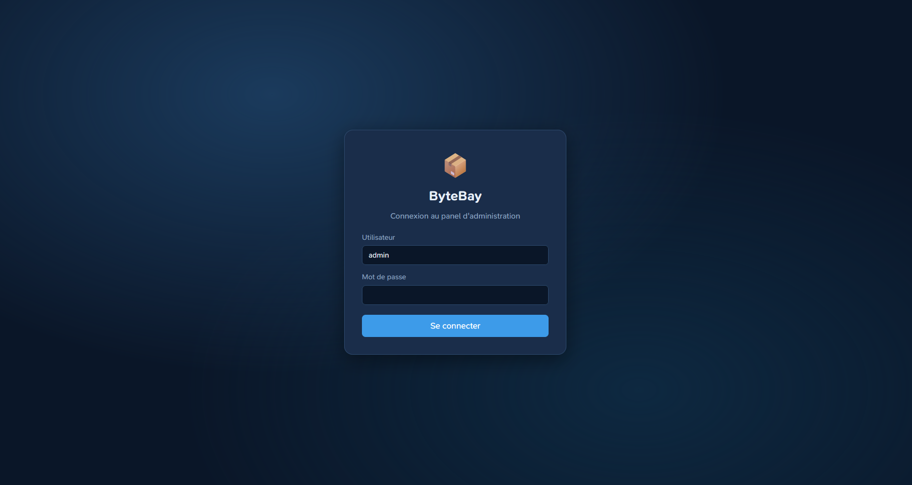
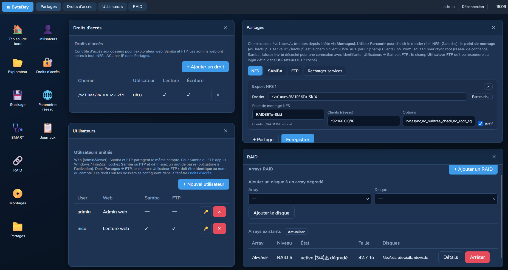

# Features

## Web desktop

Synology-like desktop with taskbar and resizable windows. **Escape** closes the topmost window.

| App | Description |
|-----|-------------|
| Dashboard | Agent / engine health |
| File explorer | Tree + file list, upload, preview |
| Storage | Disk inventory |
| SMART | Disk health, detail window |
| RAID | Create arrays, degraded detail, add disk |
| Mounts | Format/mount volumes to `/volumes` |
| Shares | NFS, Samba, FTP |
| Users | Web / Samba / FTP accounts |
| Access rights | Per-folder ACL |
| Network settings | netplan (IPv4/IPv6, LACP, VLAN) |

## RAID

- Levels 0, 1, 5, 6, 10 via `mdadm`
- **Degraded mode**: create RAID6 with 4 slots and 3 disks; add the 4th later
- Details: mdadm state, slots, degradation reasons, recovery progress

## Mounts

1. Create RAID (or pick a disk)
2. **Mounts**: async format with progress bar, mount under `/srv/bytebay-volumes/<name>`
3. Engine sees `/volumes/<name>` without restart
4. Create shares and ACLs on those paths

## Users and access rights

- One account = web (admin/viewer/none) + Samba + FTP flags
- **Access rights**: allowed paths for explorer and file services
- Web admins bypass ACLs

## Network shares

- **NFS**: path + client IP range
- **Samba**: CIFS shares
- **FTP**: vsftpd

Recommended paths: `/volumes/<volume>/…`

## Network

Configured via **netplan** (`90-bytebay.yaml`):

- Ethernet, **802.3ad (LACP)** bonds, VLANs
- IPv4/IPv6 DHCP or static
- Global and per-interface DNS

⚠️ Misconfiguration can lock you out — keep console access.

## Known limitations

- Samba: simplified user sync; share ACL wiring incomplete
- FTP: basic virtual user store
- No built-in HTTPS (use a reverse proxy)
- Personal project — no clustered HA
